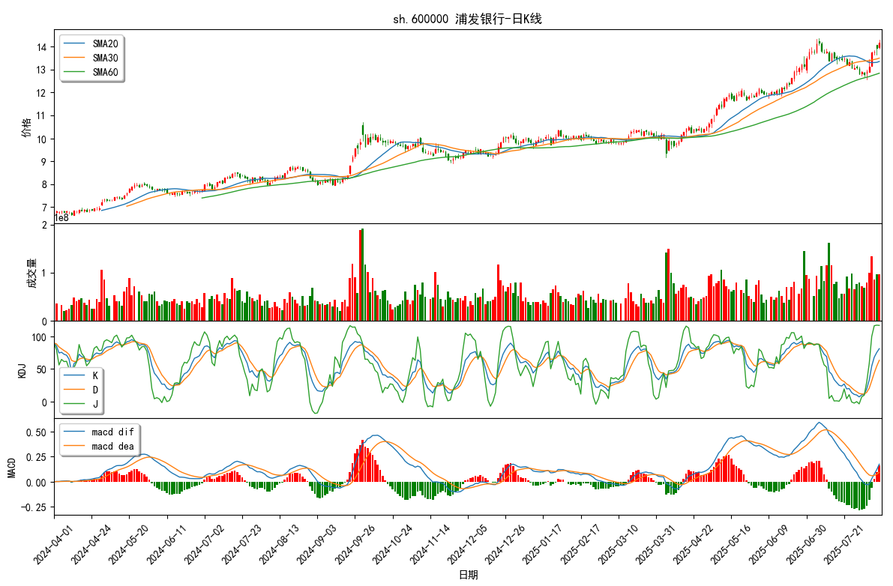

# 本文主要介绍该个人项目的测试和使用

# 1.1-使用示例1 数据获取与可视化

## 1.需要的第三方库

除了常见的python库以外，所需的库在[查看项目依赖](./../requirements.txt)

手动安装，或者在控制台输入

```python
pip install -r requirements.txt
```

---


## 2.数据获取

下面演示的代码运行在All_Test.ipynb中

### (1)获取数据

由Baostock接口获取A股市场的历史全行情，存储在stock_pool.json文件中

以字典形式，名称:代码 形式存储，筛选掉了已退市的股票

```python
from stock_project.src.data_acquisition.get_stock_pool import *
get_all_stock_to_pool()
'''
输出结果：
执行Baostock的全行情获取
login success!
login respond error_code:0
login respond  error_msg:success
logout success!
完成：获取/更新当前市场的指数、个股、转债
stock_poll.json文件存储在D:\Stock-quantification\stock_project\src\data_acquisition\../../data\stock_pool.json
'''
```

json文件中部分数据示例：

```json
{
    "股票": {
        "浦发银行": "sh.600000",
        "白云机场": "sh.600004",
        "东风股份": "sh.600006",
        "中国国贸": "sh.600007",
        "首创环保": "sh.600008",
        "上海机场": "sh.600009",
        "包钢股份": "sh.600010",
        "华能国际": "sh.600011",
        "皖通高速": "sh.600012",
        "华夏银行": "sh.600015",
        "民生银行": "sh.600016",
        "日照港": "sh.600017",
        "上港集团": "sh.600018",
```


### (2)存入到数据库

需要先生成stock_pool.json文件

由Baostock接口获取A股日k线数据，存储在stock-data.db中

```python
from stock_project.src.SQLbase.SQLite_manage import *
#输入值：table_name自选池名称,start,end:格式为YYYY-MM-DD形式的日期
stock_to_sql_for('STOCK000001','2024-01-01','2025-08-08')
'''
部分输出结果：
已创建数据库表: STOCK000001
login success!
right code is sh.600000
right code is sh.600004
right code is sh.600006
...
right code is sz.301665
right code is sz.301678
right code is sz.302132
logout success!
导入数据库完成
数据已保存到: D:\Stock-quantification\stock_project\src\SQLbase\../../data\stock-data.db
'''
```

数据库存储为Baostock输出的原始格式

```python
'''
date:交易所行情日期
code:证券代码
open:开盘价
high:最高价
low:最低价
close:收盘价
preclose:前收盘价（当日发生除权除息时，“前收盘价”不是前一天的实际收盘价）
volume:成交量（累计 单位：股）
amount:成交额（单位：人民币元）
adjustflag:复权状态(1：后复权， 2：前复权，3：不复权）
turn:换手率
tradestatus:交易状态(1：正常交易 0：停牌）
pctChg:涨跌幅（百分比）
peTTM:滚动市盈率
pbMRQ:市净率
psTTM:滚动市销率
pcfNcfTTM:滚动市现率
isST:是否ST股，1是，0否
'''
```

生成后，可以查询数据库数据

```python
sql_query_table('STOCK000001')
```


也可以删除数据库数据

```python
sql_drop_table('STOCK000001')
'''
输出结果：
"表 'STOCK000001' 已成功删除"
'''
```

### （3）数据补充部分

自动判定数据库中最新的日期数据，补充该日期到今日之间的缺失数据

若当前为交易日，限定为下午四点补充当日数据

可以手动补充，策略加载时也会提前补充

```python
from stock_project.src.data_acquisition.stock_data_complement import data_complement
data_complement()
```

---


## 3.数据可视化

```python
from stock_project.src.SQLbase.stock_matplotlib_interface import *
```

引用数据可视化模块

注意会提示mpl_finance已经过时，但是仍然可以正常使用（后续会改进）

下面的函数都为同样的输入变量

```python
'''
table_name:数据库名，和创建时一样
stock_code：股票名称，sz.或sh.+6位代码
start=None,end=None：开始结束日期，默认数据库里最开始/最后的日期,格式为YYYY-MM-DD
'''
```

开始结束的最大日期为存取的数据库内的范围的日期

示例:

获取日k线

```python
draw_kline_chart('STOCK000001', 'sh.600000','2024-04-01','2025-08-08')
```


其余数据、指标不再重复演示，下方为函数：

```python
#绘制k线
draw_kline_chart(table_name, stock_code,start=None,end=None)

#绘制成交量
draw_volume_chart(table_name, stock_code,start=None,end=None)

#绘制均线（20日，30日，60日均线）
draw_sma_chart(table_name, stock_code,start=None,end=None)

#绘制KDJ图
draw_kdj_chart(table_name, stock_code,start=None,end=None)

#绘制MACD图
draw_macd_chart(table_name, stock_code,start=None,end=None)

# 绘制均线金叉和死叉
draw_cross_annotate(table_name, stock_code,start=None,end=None)

#绘制带有跳空缺口的k线图
draw_gap_annotate(table_name, stock_code,start=None,end=None)

#周k线绘制
#基于日数据的变换
draw_kweek_chart(table_name, stock_code,start=None,end=None)

#支撑线，黄金分割线(加上k线)
draw_fibonacci_chart(table_name, stock_code,start=None,end=None)
```

基于TA-Lib的计算，可视化函数

```python
# 绘制talib SMA移动平均线
draw_talib_sma_chart(table_name, stock_code,start=None,end=None)

# 绘制talib MACD
draw_talib_macd_chart(table_name, stock_code,start=None,end=None)

#绘制talib KDJ
draw_takdj_chart(table_name, stock_code,start=None,end=None)

# 绘制 talib K线形态 乌云压顶
draw_talib_kpattern_annotate(table_name, stock_code,start=None,end=None)

```

最后是综合行情数据显示，集合了日K线，均线，成交量，KDJ，MACD的显示，更接近实际金融界面的视图

```python
draw_integrated_interface('STOCK000001', 'sh.600000','2024-04-01','2025-08-08')
'''
输出结果：
输出[ochl]可视化图表:
输出[sma]可视化图表:
输出[vol]可视化图表:
输出[kdj]可视化图表:
输出[macd]可视化图表:
'''
```


