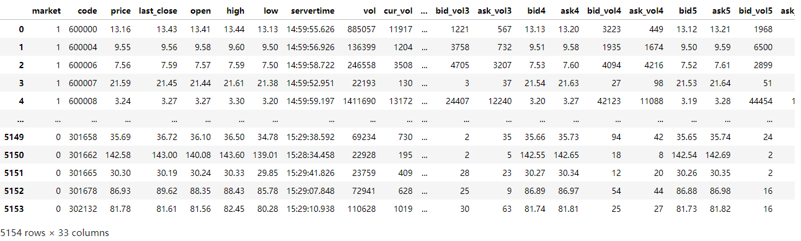

# 1.2-使用示例2 实时数据获取与策略筛选

## 1.第三方库获取实时的股票数据

（仅为原理演示）

pytdx是一个第三方数据接口，原理为连接通达信服务器返回数据

```python
from pytdx.config.hosts import hq_hosts
hq_hosts

'''
输出结果
[('长城国瑞电信1', '218.85.139.19', 7709),
 ('长城国瑞电信2', '218.85.139.20', 7709),
 ('长城国瑞网通', '58.23.131.163', 7709),
 ('上证云成都电信一', '218.6.170.47', 7709),
 ('上证云北京联通一', '123.125.108.14', 7709),
等服务器地址
'''
```

注意只有一部分服务器地址如今可用，获取数据方法如下

```python
from pytdx.hq import TdxHq_API
api = TdxHq_API(heartbeat=True)
api.connect('60.191.117.167', 7709)
out2 = api.get_security_quotes([(0, '000001'),(1, '600300')])
print(out2)
api.disconnect()
```

项目内也有已经处理完成的获取全A股实时数据的代码

去除了部分通过接口返回的无意义的值

```python
from stock_project.src.data_acquisition.stock_get_tdx import *
pytdx_nowdata_stock()
```



---


## 2. 策略筛选部分

以stock_strategy中的DTZS_strategy.py为例

该文件为个人自研的策略，参考该策略，同样可以开发其他不同方法的策略

该个人策略仅构成演示功能，不作为有效策略使用

```python
#多头择时量化策略（股票）

"""
选股策略：
筛选1（初筛）：
    条件1：
        若权限不足，剔除创业板，科创板，新股
    条件2：
        剔除st股票
    条件3：
        剔除上市4个月内的新股

条件1：
    均线多头排列，5均在10均之上，10均在20均之上，等等
条件2：
    当前股价在5均之上
条件3：
    股价出现阳包阴，缓冲30分钟
    即当前股价出现阳线，当前价格超过了上一根阴线的高点

条件5：
    各类技术指标加分

买入仓位策略：
    加权条件1：
        股价在前a日处于横盘窄幅震荡，波动率不超过b，监控这几日的最高点，
        阳包阴没有超过近日高点减分，超过加分

-----------------------------------------------------------------
卖出/减仓/止损条件：
条件1：
    股价出现阴包阳并且跌破五日均线
条件2：
    股价在距离近日最高点回撤超过x
条件3：
    当日跌幅达到a以下，超过半个小时，或者当日跌幅达到b以下
条件4：
    各类技术指标减分

卖出仓位策略：
    加权条件1：
        当日/近日大盘指数影响分
    加权条件2：
        当日/近日该板块影响分
"""
```

首先需要对策略筛选进行一次初筛，如该策略所示，剔除st股票，剔除上市4个月内的新股等

在代码中的filter_conditions可以控制是否执行

```python
filter_conditions = {
        "exclude_gem": True,  # 剔除创业板
        "exclude_star_market": True,  # 剔除科创板
        "exclude_st": True,  # 剔除ST股
        "exclude_new_stock": True  # 剔除新股
        "exclude_market_value":True  #市值筛选
    }
```

获取全股票名称

```python
from stock_project.stock_strategy.DTZS_strategy import *
get_all_stock_code()
```

初筛，避免数据过多，进行初次筛选，只需运行一次

运行的末尾会预先加载返回庞大的数据量，预先加载的目的是为了后续二筛重复循环运行减少时间

初筛剔除剔除创业板，科创板，新股

```python
code_name_map, stock_require_data = apply_stock_filters_first(get_all_stock_code())
```

接下来是二筛，条件：

    均线多头排列，5均在10均之上，10均在20均之上，等等

    当前股价在5均之上

    股价出现阳包阴

    剔除震荡格局的股票

    股票在一年内距离现价增长了x%

```python
apply_stock_filters_second(code_name_map,stock_require_data)
```

这样就能筛选出对应条件的股票

完成筛选后，股票会加入股票池文件monitoring_pool.csv，并且在monitoring_history.csv记录


同样的，在股票池里的文件也会进行策略筛选，如果满足卖出条件，则会把这只股票从池子中筛除掉，并且在monitoring_history.csv记录

这样就完成了买入条件和卖出条件的判别。在之后的优化中可以在运行过程中插入基于技术指标的判别，插入自动化买入卖出的模块，插入仓位管理的模块等。


